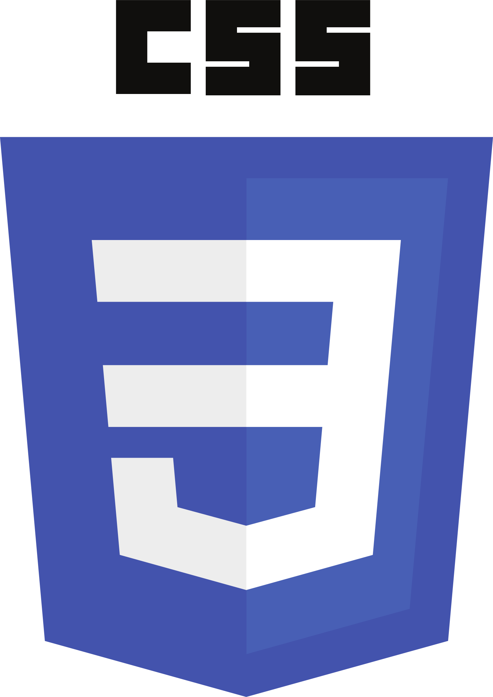

## Hello there😎 
</h2>

<!-- ////////////////// START README FILE /////////////////// -->

<h1 align="center">I'm Pasindu Ukwatta</h1>
<h3 align="center">Undergraduate of Information Technology, University of Moratuwa.</h3>

### Here is What I'm Working On! 👋

Here are some ideas to get you started:-
- 🌱 I’m currently learning Python 🐍 ,Java ☕,React Js 🎇,JavaScript 🧃,Kotlin 🎃,Machine Learning 🤖,Deep Learning 👾, Reinforcement learning 🛠️
- 😊 I'm Self Learner 👨‍💻
- 🔭 I Worked at Recce Labs (Pvt) Ltd as Software Engineer Intern 
- 👯 I’m looking to collaborate on Python
- 💬 Ask me about Anything , I always like to help others 
- 📫 How to reach me:pasindu.17@itfac.mrt.ac.lk
- ⚡ Fun fact: I'm always looking for fun on everything what i do 

[twitter]: https://twitter.com/pasindu_ukwatta
[linkedin]: https://www.linkedin.com/in/pasindu-ukwatta/

<!-- //////// Contact Details /////////////-->
<h3 align="left">Connect with me:</h3>

<!-- ///////////// Languages ///////////// -->
<h3 align="left">Languages and Tools:</h3>

 
  
  <!-- Python -->
 

   <!-- Java  -->
 
  
  <!-- JS -->

  
  
<!-- React JS -->
 
  
<!-- HTML -->
 
<!-- CSS -->
 
 

